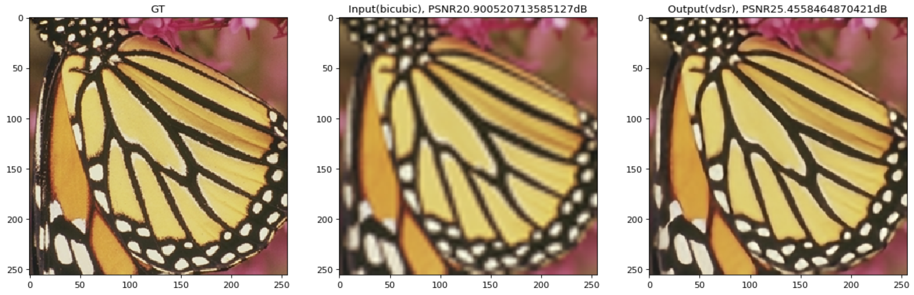

# VDSR-pytorch
VDSR: Accurate Image Super-Resolution Using Very Deep Convolutional Networks  
Paper: [Link](https://cv.snu.ac.kr/research/VDSR/VDSR_CVPR2016.pdf)

## Usage
### Training
```
usage: python3 train.py
```
### Demo
```
usage: python3 demo.py
```
- Image filename must be `test.jpg` at the root folder of this repo.
- Output file will be save as `out.jpg` at the root folder of this repo.

### Prepare Training and Testing dataset
  - The dataset will be automatically downloaded during loading the dataloader.
  
### Performance
  - Trained my VDSR model with [291](https://drive.google.com/open?id=1Rt3asDLuMgLuJvPA1YrhyjWhb97Ly742) images with data augmentation
  - No bias is used in this implementation, and didn't used gradient clipping.
  - Used Adam optimizer instead of SGD.
  - Random crop & rotation & flip is used with torchvision.
  - Performance in PSNR on Set5
  
| Scale        | VDSR Paper          | VDSR PyTorch|
| ------------- |:-------------:| -----:|
| 2x      | 37.53      | 37.20 |
| 3x      | 33.66      | 33.33|
| 4x      | 31.35      | 31.20 |

<p>
  
</p>
